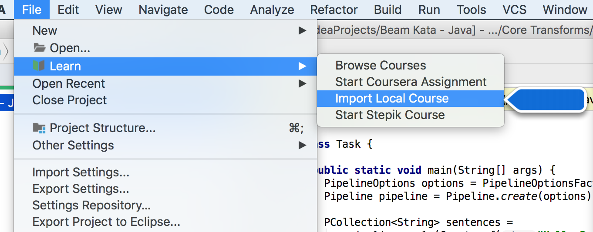
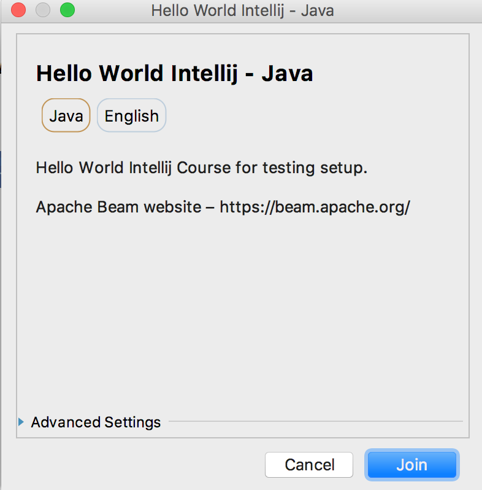

# Apache Beam Training

This is the Kata Beam training course for Apache Beam SDK. Below is the pre-requisite installations
* JDK 8 or above
* Maven 
* IntelliJ Educational Tool - https://www.jetbrains.com/education

### Start Guide
<p align="left">
* Get HelloWorldCourse.zip in this repo and download to your local machine

* Import the zip file directly as below


* Press "Join"


* Open Task.java

* Replace the following code in the function and press "Check"

```
  static PCollection<String> setupPipeline(Pipeline pipeline) {
    return pipeline.apply(Create.of("Hello World"));
  }
```

* Done

</p>
